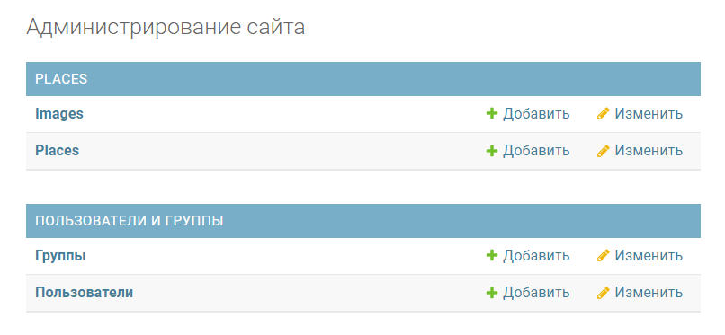
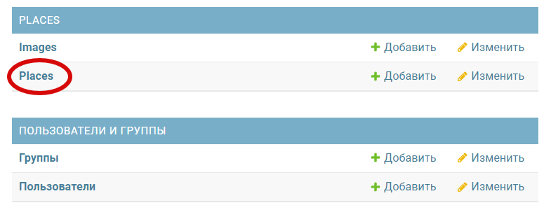
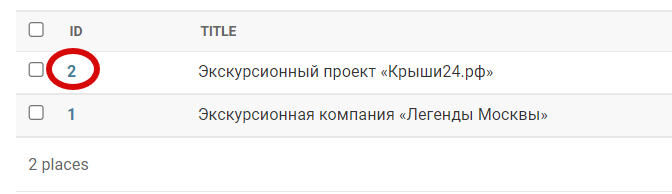
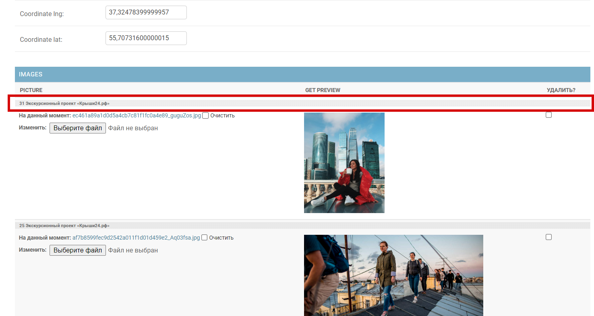
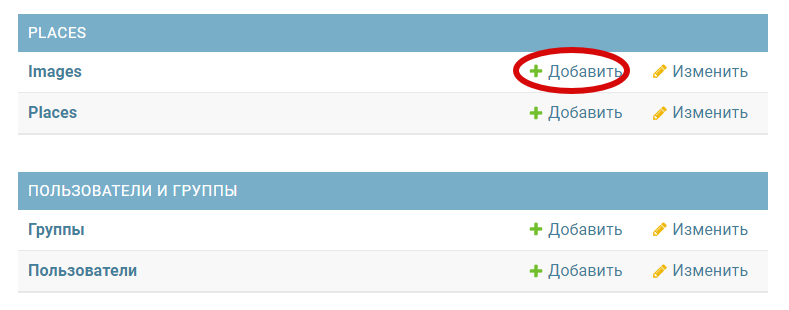
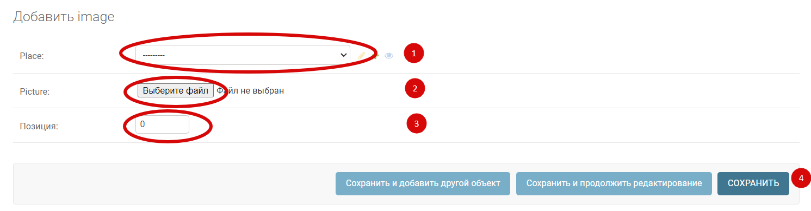

# Where To Go

The program allows you to display in the browser on an interactive map of the city
the locations of the additional attractions. When you click on the place marked with a red dot,
a description appears on the right side of the screen. The program provides the ability
to add and edit attractions, as well as their detailed descriptions. 
For convenience, there is an HTML editor in the administrative access of the site.
[See example](https://python-scripts.com/virtualenv) of a working website.


The code is written for educational purposes — this is a lesson in a course on Python and web development on the Devman website.
The test data is taken from the KudaGo website.

## Enviroments

- create the file .env and fill in this data:
  - DEBUG
  - SECRET_KEY
  - ALLOWED_HOSTS

# For developers
## Installing

To get started go to terminal(mac os) or CMD (Windows)
- create virtualenv, [See example](https://python-scripts.com/virtualenv)

```bash
$python virtualenv venv
```

- clone github repository

```bash
$git clone https://github.com/Rostwik/Where_to_go
```

- install packages

```bash
$pip install -r requirements.txt
```

- run site

```bash
$python manage.py runserver
```

## Working with Database 

- run the following commands to migrate models into DB:

```bash
$python manage.py migrate 
```

- for Admin access to database create super user 

```bash
$python manage.py createsuperuser"
```

- run the local server and pass to `http://127.0.0.1:8000/admin` to login to admin webpage
```bash
python manage.py runserver
```
## How to use the site
- add location

Сlick on the link and enter the administrator login and password 
[admin access link](http://127.0.0.1:8000/admin).

To add a new location, click on the "Add" plus.

- edit location

Go to the list of all locations, click on the "Places" field.

Choosing the necessary location:

In the lower part of the interface, the linked images are located,
in addition to adding and replacing images, you can change their order
by holding and moving the field:

- add photos

To add photos to a specific location, you need to add them and link them to the location.
To do this, go to the photos interface by clicking on "Images" on the main page:


Next, select the location for which this image will be displayed, select the image,
specify the position of the sequence in the list of all images and click the "Save" button.


## The function of adding a new attraction to the map

For convenience, the possibility of adding a new attraction by link is implemented.

```bash
$python manage.py load_place 'url' 
```

url - link to json, see an example of such a link below:
[url](https://raw.githubusercontent.com/devmanorg/where-to-go-places/master/places/%D0%92%D0%BE%D0%B4%D0%BE%D0%BF%D0%B0%D0%B4%20%D0%A0%D0%B0%D0%B4%D1%83%D0%B6%D0%BD%D1%8B%D0%B9.json)

## Working demo version of the site

[Where to Go](https://roronoazorostislav.pythonanywhere.com/)

# Author

* **Rostislav** - [Rostislav](https://github.com/Rostwik)

# License

This project is licensed under the MIT License - see the [LICENSE.md](LICENSE.md) file for details


