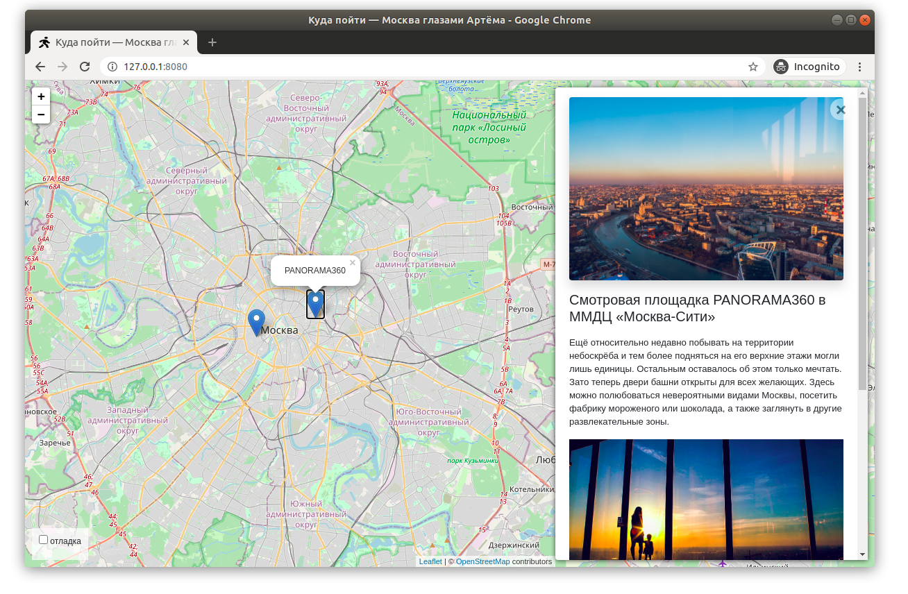

# Where To Go

The program allows you to display in the browser on an interactive map of the city
the locations of the additional attractions. When you click on the place marked with a red dot,
a description appears on the right side of the screen. The program provides the ability
to add and edit attractions, as well as their detailed descriptions. 
For convenience, there is an HTML editor in the administrative access of the site.
[See example](https://python-scripts.com/virtualenv) of a working website.



Код написан в учебных целях — это урок в курсе по Python и веб-разработке на сайте Devman.
Тестовые данные взяты с сайта KudaGo.

## Enviroments

- create the file .env and fill in this data:
  - DEBUG
  - SECRET_KEY
  - ALLOWED_HOSTS

# For developers
## Installing

To get started go to terminal(mac os) or CMD (Windows)
- create virtualenv, [See example](https://python-scripts.com/virtualenv)

```bash
$python virtualenv venv
```

- clone github repository

```bash
$git clone https://github.com/Rostwik/Where_to_go
```

- install packages

```bash
$pip install -r requirements.txt
```

- run site

```bash
$python manage.py runserver
```

## Working with Database 

- run the following commands to migrate models into DB:

```bash
$python manage.py migrate 
```

- for Admin access to database create super user 

```bash
$python manage.py createsuperuser"
```

- run the local server and pass to `http://127.0.0.1:8000/admin` to login to admin webpage
```bash
python manage.py runserver
```
## How to use the site
- add location

Сlick on the link and enter the administrator login and password 
[admin access link](http://127.0.0.1:8000/admin).

To add a new location, click on the "Add" plus.

- edit location
  
Заходим в список всех локаций, нажимаем на поле "Places".

Выбираем необходимую локацию:

В нижней части интерфейса располоенные привязанные изображения,
помимо добавления и замены изображений, можно менять их порядок,
методом удерживания и перемещения поля:

- add photos

Чтобы добавить фотографии к конкретной локации необходимо их добавить и привязать к локации.
Для этого необходимо зайти в интерфейс фотографий, нажав на "Images" на главной странице:


Далее выбрать локацию, для которой это изображение будет отображаться, выбрать изображение, 
указать позцию следования в списке всех изобажений и нажать кнопку "Сохранить".


# Author

* **Rostislav** - [Rostislav](https://github.com/Rostwik)

# License

This project is licensed under the MIT License - see the [LICENSE.md](LICENSE.md) file for details


